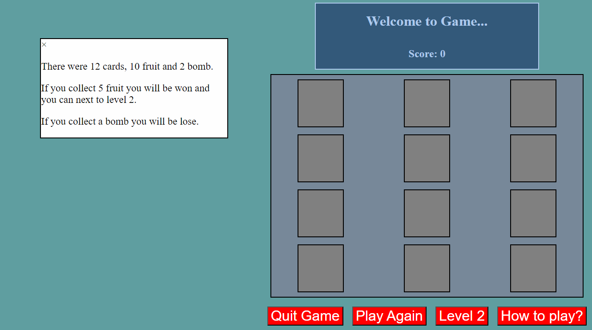
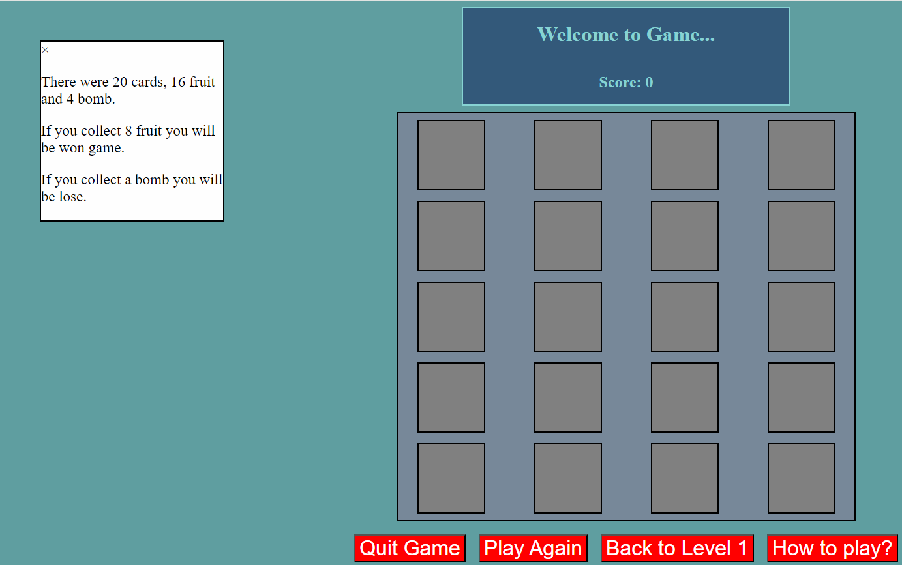

# ProjectFlashMemoryGame

## Date: 5/2/2024

### By: Ali Khamis

#### [GitHub](https://github.com/ali5amis) | [LinkedIn](https://www.linkedin.com/in/3li-jaafar/)

---

### **_Description_**

#### A brief description of the project, what it's about, when and what you made it for, etc. ...

#### The game is Memory Flash Card where user will be shown on a page multiply card and catch your fruit and there were fruits and bombs, users should to score above +5 to next level 2

### **_Getting Started_**

#### On the page will show 3x4 cards, display score and Reset and playagain. catch your fruit on cards but cards is hidden and you should to catch your cards there are 10 cards fruits and 2 cards bomb u should score minimum +5 to won and the level 2 the same level 1 but there were cards 4x5 there were 16 cards fruits and 4 cards bomb, you should to score +8 to won a game.

---

### **_Screenshots_**

##### image header 1

##### image header 2

### **_Credits_**

##### Funny Images: [DuckDuckGo Search](http://www.duckduckgo.com)

##### Markdown Guide: [ia.net](https://ia.net/writer/support/general/markdown-guide)

##### Markdown Cheatsheet: [GitHub](https://guides.github.com/pdfs/markdown-cheatsheet-online.pdf)

---
